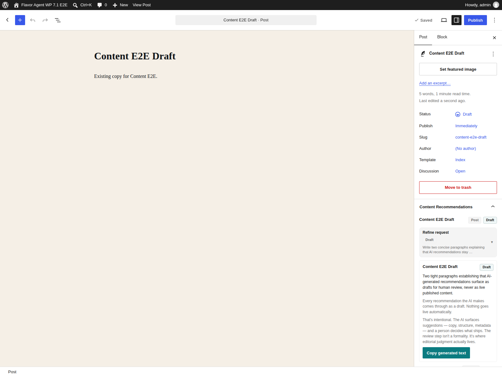

# WordPress 7.1 Anthropic Native-Editor Proof - 2026-08-26

Run time: 2026-08-26T07:02:05Z (server-side request activity time).

Repository runtime identity: `4831b4e000b1f004e00baccdfdfaacffc4bfa861`
(`master`). The capture ran before any plugin runtime source changed; the working
tree contained release-document and corpus-updater work that did not affect the
editor recommendation implementation.

## Result

Status: **pass** for the minimum native-editor visual proof gate.

The WordPress 7.1 post editor rendered a fresh Anthropic-backed
`flavor-agent/recommend-content` result in the native **Content
Recommendations** document panel. The generated copy remained a reviewable
draft and exposed **Copy generated text**; it was not inserted, applied, saved
as post content, or published.

Screenshot identity:

- Path: `docs/screenshots/content-recommendation.png`
- Dimensions: `1600 x 1200`
- SHA-256: `451b393b9c94200dd5d41f7edfef64c08d72912bc91f9267d9e1679b45fbf1b9`

## Environment

- WordPress: `7.1`
- Harness image: `wordpress:7.1.0-php8.2-apache`
- PHP: `8.2.33`
- Flavor Agent: `0.1.0`
- AI plugin: `1.3.0`
- Anthropic Connector: `1.0.4`
- Provider: `anthropic`
- Model: `claude-sonnet-4-6`
- Provider path: `Anthropic via Settings > Connectors`
- Ability: `flavor-agent/recommend-content`
- Browser: Playwright Chromium, `1600 x 1200`

The Browser skill was not installed in this session, so the repository's
Playwright WordPress 7.1 harness was used as the documented fallback. The
harness used public `mariadb:11.4` because the default private `dhi.io` MariaDB
image was not anonymously accessible.

## Runtime and interaction evidence

The capture flow was:

1. Authenticate to the pinned WordPress 7.1 harness.
2. Open a seeded draft in the native post editor.
3. Open **Content Recommendations**.
4. Enter a synthetic request explaining that AI recommendations remain
   reviewable drafts and are never auto-published.
5. Execute the production `RecommendContentAbility` path through the WordPress
   AI Client and Anthropic Connector.
6. Return that fresh result to the same editor request and assert that its title
   and first generated paragraph were visible before capturing the screenshot.

Playwright result: `2 passed` (authentication setup plus the target editor
interaction); the target interaction completed in `17.2s`, with `41.1s` total
runner time.

The latest server-side activity row independently recorded:

- Surface: `content`
- Activity type: `request_diagnostic`
- Provider: `anthropic`
- Model: `claude-sonnet-4-6`
- Provider path: `Anthropic via Settings > Connectors`
- Request ability: `flavor-agent/recommend-content`
- Created at: `2026-08-26 07:02:05` UTC

The temporary test-only bridge used to pass the environment credential into the
CLI request was removed immediately after capture. `git diff` confirms the E2E
spec returned to its original state.

## Credential and browser-health checks

`ANTHROPIC_API_KEY` was read from the ignored local `.env` file and inherited by
the Playwright and WordPress CLI child processes. The key value was never
printed, placed in a command argument, written into the screenshot, or stored in
a WordPress option. A post-run presence check confirmed the Anthropic database
credential option remained empty.

A clean follow-up editor load recorded:

- Expected post-editor URL and page title: present
- Meaningful editor content: present
- Flavor Agent data store: ready
- Framework error overlays: `0`
- Page errors: `0`
- Console errors: `0`
- Console warnings: `1`

The single warning was WordPress 7.1's existing iframe-enqueue warning for
`global-styles-css-custom-properties-inline-css`; it did not name Flavor Agent,
did not create a page error, and did not affect the recommendation interaction
or screenshot.

## Boundary

This closes the repository's minimum visual gate: the governance-console image
plus one strong native-editor recommendation still now exist. It is local
candidate evidence, not a public staging-host capture and not exact-tag proof.
The final release still requires the clean artifact and immutable-tag checks.
